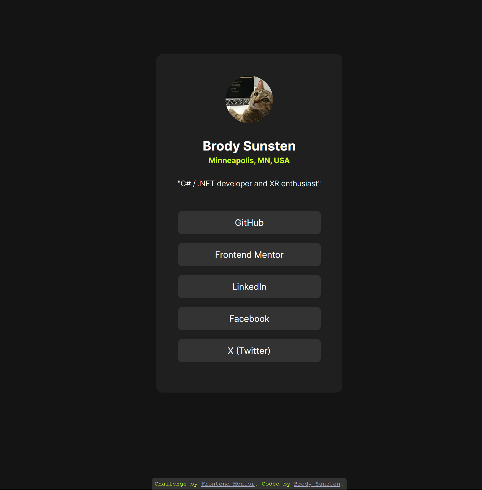

# Frontend Mentor - Social links profile solution

This is a solution to the [Social links profile challenge on Frontend Mentor](https://www.frontendmentor.io/challenges/social-links-profile-UG32l9m6dQ).

## Table of contents

- [Overview](#overview)
  - [The challenge](#the-challenge)
  - [Screenshot](#screenshot)
  - [Links](#links)
- [My process](#my-process)
  - [Built with](#built-with)
  - [What I learned](#what-i-learned)
  - [Continued development](#continued-development)
  - [AI Collaboration](#ai-collaboration)

## Overview

The goal of this project is to set up a simple social media link sharing page with interactive elements.

### The challenge

Users should be able to:

- See hover and focus states for all interactive elements on the page

### Screenshot

### Links

- Live Site URL: [Click here](https://bsunsten.github.io/FMIO-Social-Links/)

## My process

This project was a good test of my former CSS knowledge. I initially began the layout using flexbox, but have been attempting to utilize the `<main>` tag for accessibilty, which led to working around nested flexboxes. I was suggested to use CSS Grid instead, which turned out to be easier! I also utilized the Figma designs this time to get more accurate CSS values. 

### Built with

- Semantic HTML5 markup
- CSS custom properties
- Flexbox
- CSS Grid
- Mobile-first workflow

### What I learned

I learned quite a bit working on this page! I learned how to set custom CSS variables using `:root`, which was helpful with reusing colors. I also feel like I have a better understanding of when to use flexbox and how to space things properly, especially using the `gap` attribute.. Beyond just code, I also gained some practice incorporating values from Figma designs to make things more accurate.

### Continued development

I want to continue working from Figma designs now, it was really helpful for making things like border radii accurate to the design. 

### AI Collaboration

I utilized Claude code for some of the spacing and suggestions for improvements on my design. An example of this was learning that `<ul>` elements have a default left-padding of 40px, or expanding the width of my `<a>` links to the full width of the containing list elements.  
